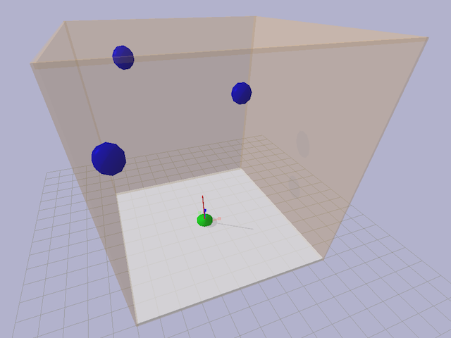

# CartPole Domain

## Table of Contents

* [Task Description](#taskdescription)
* [Feature Vector Format](#featurevectorformat)
* [Action Label](#actionlabel)
* [Performance](#performance)
* [Novelty Indicator](#noveltyindicator)
* [Novelty Characterization](#noveltycharacterization)
* [Sample (Mock) Novelty](#samplemocknovelty)
* [Frequently Asked Questions](#faq)

<a name="taskdescription">

## Task Description



For the Phase 2 novelty-level-0 CartPole task, the agent must keep the pole balanced
by pushing the cart forward, backward, left or right. The cart is constrained to move
in a 2D plane. The pole is affixed to the cart and can move around that fixed point
in any direction. There are other objects in the environment that move in 3D and may
collide with cart, pole, walls, or each other. The agent receives sensor
data about the time, the position and velocity of the cart, the angles and
angular velocity of the pole, and the position and velocity of the objects. The agent
also receives feedback about their current performance and an optional image. The
cart, pole and objects have different random starting states each episode. An episode ends
if the cart moves too far from center, the absolute pole angle is too large,
or a time limit is exceeded. The time limit is 200 ticks of the game, where each tick
corresponds to 0.02 seconds. The agent's final score is T/200, where T the number of
ticks they keep the pole balanced.

The graphic below provides more information about the geometry used in CartPole.


See the [cartpole.json](cartpole.json) file for a precise specification of the
domain, including ranges on sensor values.

<a name="featurevectorformat">

## Feature Vector Format

The feature vector provides a value for each sensor and is sent in JSON format.
For example,

```
{
    "cart": {
        "x_position": -0.885514,
        "y_position": -1.605059,
        "z_position": 0.1,
        "x_velocity": -11.970514,
        "y_velocity": 1.005748,
        "z_velocity": 0.0
    },
    "pole": {
        "x_quaternion": 0.064607,
        "y_quaternion": -0.065981,
        "z_quaternion": 0.67565,
        "w_quaternion": 0.731416,
        "x_velocity": 2.085099,
        "y_velocity": -0.892353,
        "z_velocity": 11.80254
    },
    "blocks": [
        {
            "id": 2,
            "x_position": -1.86226,
            "y_position": 2.550503,
            "z_position": 6.339546,
            "x_velocity": 7.707002,
            "y_velocity": -8.587865,
            "z_velocity": 6.575934
        },
        {
            "id": 3,
            "x_position": -1.275671,
            "y_position": 1.31081,
            "z_position": 2.180347,
            "x_velocity": 9.403932,
            "y_velocity": -6.88735,
            "z_velocity": 9.195959
        }
    ],

    "time_stamp": 1627668897.4486113,
    "image": null
}

```
The first call will have additional feature vector defining the corners of the cube world.

```
    "walls": [
        [-5,-5, 0],
        [5,-5, 0],
        [5,5, 0],
        [-5,5, 0],
        [-5,-5, 10],
        [5,-5, 10],
        [5,5, 10],
        [-5,5, 10],
    ]
```

<a name="actionlabel">

## Action Label

Each turn, the agent provides an action to be performed, which is one of
['nothing', 'left', 'right', 'forward', 'backward']. The returned action is
referred to as the "label", which is an artifact of other domains in which
the task is classification.

<a name="performance">

## Performance

The current performance of the agent on the current episode is provided as
feedback after each agent response and is sent in JSON format. For CartPole,
performance is defined as the amount of time the pole is kept balanced
divided by the maximum time for the episode. The performance at the end of
the episode is recorded as the performance for that entire episode.

<a name="noveltyindicator">

## Novelty Indicator

After each sensor fecture vector, the novelty generator sends a novelty
indicator, which indicates if the current episode is novel "true", not novel
"false" (i.e., novelty level 0), or unknown "null". The novelty indicator will
be the same for every turn during an episode.

<a name="noveltycharacterization">

## Novelty Characterization

At the end of each episode, the agent provides a novelty characterization
for the episode, which includes a probability of novelty, probability threshold,
novelty level, and a characterization string.

<a name="samplemocknovelty">

## Sample (Mock) Novelty

The CartPole novelty generator includes sample Phase 2 novelties for levels 1-5,
also called Mock novelties. These are described below.

* Level 1: The mass of the cart changes.
* Level 2: The objects are immovable.
* Level 3: The objects initially move toward some random point.
* Level 4: The objects change size.
* Level 5: The objects are attracted to each other.

The implementations of these mock novelties can be found in the folder
[WSU-Portable-Generator/source/partial_env_generator/envs/cartpolepp](https://github.com/holderlb/WSU-SAILON-NG/tree/master/WSU-Portable-Generator/source/partial_env_generator/envs/cartpolepp).

<a name="faq">

## Frequently Asked Questions

Coming soon...

