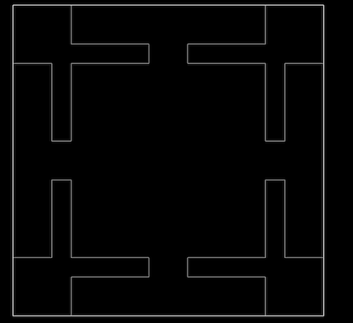

# VizDoom Domain

For the Phase 2 novelty-level-0 VizDoom task, the agent (player) must kill all
the enemies in the environment. The map for all Phase 2 levels is fixed and
shown below. The agent has eight actions: forward, backward, left, right, turn left
45 degrees, turn right 45 degrees, shoot and do nothing. The enemies have the same actions
(except do nothing). In level 0, the agent and 2-4 enemies spawn in random locations
in the map. Enemies move randomly, but can shoot at the agent if facing them. The
agent and enemies all use the pistol for a weapon and bullets for ammo. The agent
begins with some amount of health and ammo. Enemies also begin with some amount of
health, but infinite ammo. There are objects in the environment: health packs,
ammo packs, traps (negative health packs), and fixed obstacles. The player collects
packs by moving over them. The enemies do not collect packs.

On each turn, the agent receives sensor information about the state of the game,
including the agent's location, orientation, health and ammo; each enemy's
location, orientation and health; and the locations of all packs and obstacles.
The geometry (walls) of the map are provided in the first set of sensor information.
An optional image is also available.

The agent has 2000 game ticks to kill all the enemies. A game tick corresponds to
0.02 seconds in the game. An episode ends when either all the enemies are dead,
the agent dies, or a time limit is exceeded. The score for the episode is
(2000 - T) / 2000, where T is the time at which the agent wins the game (kills
all the enemies). If the agent dies, or runs out of time, the score is zero.



See the [vizdoom.json](vizdoom.json) file for a precise specification of the
domain, including ranges on sensor values.

## Feature vector format

The feature vector provides a value for each sensor and is sent in JSON format.
The high-level sensor information includes "enemies", "items", "player", "timestamp"
and "image". The "enemies" array includes an entry for each live enemy, which
includes their ID, orientation, position, and health. The player object includes
the agent's ID, orientation, position, health and ammo. The "items" array includes
subarrays for "health", "ammo", "trap" and "obstacle". Each of these subarrays
includes ID, position and orientation information for uncollected items.
See below for an example.


```
{
    "enemies": [
        {
            "id": 1,
            "angle": 270.0,
            "x_position": 235.0094,
            "y_position": 17.6364,
            "z_position": 0.0,
            "name": "ZombieMan",
            "health": 20.0
        }
    ],
    "items": {
        "health": [
            {
                "id": 9,
                "angle": 0.0,
                "x_position": 447.5784,
                "y_position": 195.6249,
                "z_position": 0.0
            },
            {
                "id": 10,
                "angle": 0.0,
                "x_position": -287.9644,
                "y_position": 85.8104,
                "z_position": 0.0
            },
            {
                "id": 11,
                "angle": 0.0,
                "x_position": -18.8223,
                "y_position": 76.51,
                "z_position": 0.0
            }
        ],
        "ammo": [
            {
                "id": 12,
                "angle": 0.0,
                "x_position": 462.2229,
                "y_position": -174.2259,
                "z_position": 0.0
            },
            {
                "id": 13,
                "angle": 0.0,
                "x_position": 482.8499,
                "y_position": -8.8603,
                "z_position": 0.0
            },
            {
                "id": 14,
                "angle": 0.0,
                "x_position": -227.0497,
                "y_position": 123.6179,
                "z_position": 0.0
            },
            {
                "id": 15,
                "angle": 0.0,
                "x_position": -86.8704,
                "y_position": 71.5086,
                "z_position": 0.0
            }
        ],
        "trap": [
            {
                "id": 5,
                "angle": 0.0,
                "x_position": 105.1622,
                "y_position": -409.6578,
                "z_position": 0.0
            },
            {
                "id": 6,
                "angle": 0.0,
                "x_position": 218.5878,
                "y_position": 474.754,
                "z_position": 0.0
            },
            {
                "id": 7,
                "angle": 0.0,
                "x_position": 208.1536,
                "y_position": 117.6079,
                "z_position": 0.0
            },
            {
                "id": 8,
                "angle": 0.0,
                "x_position": 218.2329,
                "y_position": 5.6266,
                "z_position": 0.0
            }
        ],
        "obstacle": [
            {
                "id": 3,
                "angle": 0.0,
                "x_position": -25.2912,
                "y_position": 208.6945,
                "z_position": 0.0
            },
            {
                "id": 4,
                "angle": 0.0,
                "x_position": -52.338,
                "y_position": 473.5073,
                "z_position": 0.0
            }
        ]
    },
    "player": {
        "id": 16,
        "angle": 180.0,
        "x_position": 118.7994,
        "y_position": -284.8702,
        "z_position": 0.0,
        "health": 65.0
        "ammo": 20.0
    },
    "time_stamp": 1627669530.0396042,
    "image": null
}
```
Additional wall sensor will be sent on the intial feature_vector:

```
    "walls": [
        {
            "x1": -320.0,
            "x2": -64.0,
            "y1": 320.0,
            "y2": 320.0
        },
        {
            "x1": 320.0,
            "x2": 320.0,
            "y1": 320.0,
            "y2": 64.0
        },
        ...
```

## Action label

Each turn, the agent provides an action to be performed, which is one of
['nothing', 'left', 'right', 'forward', 'backward', 'shoot', 'turn_left', 'turn_right'].
The returned action is
referred to as the "label", which is an artifact of other domains in which
the task is classification.

## Performance

The current performance of the agent on the current episode is provided as
feedback after each agent response and is sent in JSON format. For VizDoom,
performance is defined as the amount of time left in the episode divided by
the maximium time for the episode. The performance at the end of
the episode is recorded as the performance for that entire episode.

## Novelty indicator

After each sensor fecture vector, the novelty generator sends a novelty
indicator, which indicates if the current episode is novel "true", not novel
"false" (i.e., novelty level 0), or unknown "null". The novelty indicator will
be the same for every turn during an episode.

## Novelty characterization

At the end of each episode, the agent provides a novelty characterization
for the episode, which includes a probability of novelty, probability threshold,
novelty level, and a characterization string.

## Sample (Mock) Novelty

The VizDoom novelty generator includes sample Phase 2 novelties for levels 1-5,
also called Mock novelties. These are described below.

* Level 1: Change in number of health packs.
* Level 2: Enemies have increased speed.
* Level 3: Enemies move toward player.
* Level 4: Enemy damage increases as closer to player.
* Level 5: Enemies spread out.
